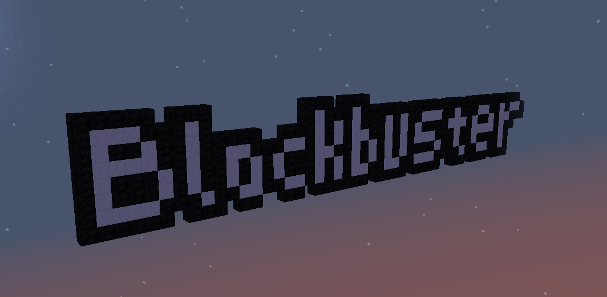

#  Blockbuster

Blockbuster (**pun intended**) is a Minecraft mod which lets you create simple 
Minecraft machinimas in single player (without having to recruit/organize a 
crowd of actors and cameras) and simple cinematics in adventure maps.

Blockbuster mod is built on top of Forge 12.17.0.1976 for Minecraft 1.9.4, and the recording 
code is based on the code borrowed from the [Mocap mod](http://www.minecraftforum.net/forums/mapping-and-modding/minecraft-mods/1445402-minecraft-motion-capture-mod-mocap-16-000) 
(the author of the mod gave me permission to use his code). 

[Original minecraft forum thread](http://www.minecraftforum.net/forums/mapping-and-modding/minecraft-mods/2700216-blockbuster-create-simple-machinimas-and-adventure). 
Tested on Mac OS X 10.10 only, but in theory supposed to work on any OS.

## Install

Install Minecraft Forge, then go to 
[releases](https://github.com/mchorse/blockbuster/releases) and download the 
latest version jar file. Put it in minecraft's `mods` folder, launch the game, 
and done. 

After that, the Blockbuster mod should be installed and will appear in Minecraft's 
mods menu. If Blockbuster didn't appear in the mods menu, then something went 
wrong.

## Videos

Blockbuster 1.0 – Tutorial by me

## Features

This mod provides following features:

#### Player's recording

* All stuff in Mocap, but more
* Interacting with blocks (opening doors, toggling levers, pushing buttons, etc.)
* Breaking blocks
* Mounting entities like pigs (tested with AnimalBikes, works well, but keep animals in fences)
* Flying the elytra
* Text formatting in chat using the '[' character instead of '§'

#### Director blocks

* Has two variations: for machinimas and for adventure maps
* Ties actors and cameras into an organizable scene (with lots of benefits)
* Can be playbacked by the playback button or the /play-director command
* Both of the block have their own GUIs for managing the cast (view, add, edit, remove, reset)

#### Actors

* Can playback player's actions
* Customizable skins (simply drop 64x32 skins into the minecraft/config/blockbsuter/skins folder)
* Mostly look like players
* When tied to director block and player starts recording this actor, player will be able to react to previously recorded actors
* When recording, HUD overlay would be displayed with caption to which file it records actions

#### Cameras

* Configurable camera's properties such as: speed, acceleration rate, maximum acceleration and flying direction
* Jump between cameras when tied to director block

#### Commands

* Record command (`/record`) – allows players to record their actions to a filename for later playback
* Play command (`/play`) – allows playback of earlier recorded file
* Play director command (`/play-director`) – allows player to trigger playback in director block specified at XYZ position
* Stop director command (`/stop-director`) – allows player to stop playback in director block specified at XYZ position

## Manual

Manual is located in the root of this repository in file named [MANUAL.md](./MANUAL.md).

## License

See file `LICENSE.md`. Most of the code is licensed under MIT license, but recording code 
from Mocap mod is actually licensed under GPL license (`noname.blockbuster.recording` package).
